# Bible Verse Detection - Simplified Flowchart

```mermaid
flowchart TD
    A[📖 Bible Page Image] --> B[🔍 Google Vision OCR]
    B --> C[📄 Raw OCR Text]

    C --> D[📝 Split into Lines]
    D --> E[🔍 Extract Verse Numbers]

    E --> F{Verse Number Found?}
    F -->|Yes| G[📋 Create New Verse Block]
    F -->|No| H{Is Continuation?}

    H -->|Yes| I[📄 Add to Current Verse]
    H -->|No| J[💾 Save Current Verse]

    G --> K[🎯 Calculate Confidence]
    I --> D
    J --> D

    K --> L[📊 Content Quality Assessment]

    L --> M[🔍 Multi-Factor Validation]

    M --> N[📏 Word Count & Length]
    M --> O[🔤 Character Quality]
    M --> P[🎲 Entropy Analysis]
    M --> Q[🖨️ OCR Artifact Detection]
    M --> R[🔗 Page Boundary Detection]

    N --> S[📊 Completeness Score]
    O --> T[📊 Character Score]
    P --> U[📊 Entropy Score]
    Q --> V[📊 Artifact Penalty]
    R --> W[📊 Boundary Penalty]

    S --> X[🎯 Combined Quality Score]
    T --> X
    U --> X
    V --> X
    W --> X

    X --> Y[🎯 Final Confidence Score]

    Y --> Z{Confidence ≥ 0.5?}
    Z -->|Yes| AA[✅ High Confidence Verse]
    Z -->|No| BB[⚠️ Low Confidence Verse]

    AA --> CC[📋 Relevant Verses]
    BB --> DD[🚫 Filtered Out]

    CC --> EE[📊 Final Results]

    %% Styling
    classDef startEnd fill:#e1f5fe,stroke:#01579b,stroke-width:2px
    classDef process fill:#f3e5f5,stroke:#4a148c,stroke-width:2px
    classDef decision fill:#fff3e0,stroke:#e65100,stroke-width:2px
    classDef validation fill:#e8f5e8,stroke:#2e7d32,stroke-width:2px
    classDef output fill:#fce4ec,stroke:#c2185b,stroke-width:2px

    class A,EE startEnd
    class B,C,D,E,G,I,J,K,L,M,N,O,P,Q,R,S,T,U,V,W,X,Y process
    class F,H,Z decision
    class AA,BB,CC,DD output
```

## Key Process Steps

### **1. Image Processing**

- **Input**: Bible page image
- **OCR**: Google Vision API extracts text
- **Output**: Raw OCR text

### **2. Verse Detection**

- **Line Processing**: Split text into individual lines
- **Pattern Matching**: Extract verse numbers using regex patterns
- **Block Creation**: Group lines into verse blocks

### **3. Quality Assessment**

- **Content Completeness**: Word count and length analysis
- **Character Quality**: Readable character ratio
- **Entropy Analysis**: Text randomness measurement
- **Artifact Detection**: OCR errors and noise
- **Boundary Detection**: Page overlaps and fragments

### **4. Confidence Scoring**

- **Multi-factor scoring**: Content length, verse format, quality
- **Penalty system**: Artifacts and fragments reduce confidence
- **Threshold filtering**: ≥0.5 for high confidence

### **5. Final Results**

- **High Confidence**: Relevant verses identified
- **Low Confidence**: Filtered out as noise/fragments
- **Statistics**: Quality metrics and performance data
