# Bible Verse Detection - Technical Flowchart

```mermaid
flowchart TD
    A[📖 Bible Page Image] --> B[🔍 Google Vision OCR]
    B --> C[📄 Raw OCR Text]

    C --> D[📝 Split Text into Lines]
    D --> E[🔍 Extract Verse Numbers]

    E --> F{Verse Number Pattern Match?}
    F -->|Yes| G[📋 Start New Verse Block]
    F -->|No| H{Is Verse Continuation?}

    H -->|Yes| I[📄 Add Line to Current Verse]
    H -->|No| J[💾 Save Current Verse Block]

    G --> K[🎯 Calculate Confidence Score]
    I --> D
    J --> D

    K --> L[📊 Content Quality Assessment]

    L --> M[🔍 Multi-Factor Validation]

    M --> N[📏 Content Completeness]
    M --> O[🔤 Character Quality]
    M --> P[🎲 Entropy Analysis]
    M --> Q[🖨️ OCR Artifact Detection]
    M --> R[🔗 Page Boundary Detection]

    N --> N1[📊 Word Count Analysis]
    N1 --> N2{Word Count ≥ 8?}
    N2 -->|Yes| N3[+0.3 Base Score]
    N2 -->|No| N4{Word Count ≥ 4?}
    N4 -->|Yes| N5[+0.2 Base Score]
    N4 -->|No| N6{Word Count ≥ 2?}
    N6 -->|Yes| N7[+0.1 Base Score]
    N6 -->|No| N8[0.0 Base Score]

    N3 --> N9[📏 Word Length Multiplier]
    N5 --> N9
    N7 --> N9
    N8 --> N9

    N9 --> N10{Avg Word Length ≥ 4?}
    N10 -->|Yes| N11[1.0x Multiplier]
    N10 -->|No| N12{Avg Word Length ≥ 3?}
    N12 -->|Yes| N13[0.8x Multiplier]
    N12 -->|No| N14[0.5x Multiplier]

    N11 --> N15[📊 Completeness Score]
    N13 --> N15
    N14 --> N15

    O --> O1[📊 Readable Character Count]
    O1 --> O2{Readable Ratio ≥ 80%?}
    O2 -->|Yes| O3[+0.2 Character Score]
    O2 -->|No| O4{Readable Ratio ≥ 60%?}
    O4 -->|Yes| O5[+0.1 Character Score]
    O4 -->|No| O6[0.0 Character Score]

    O3 --> O7[📊 Character Quality Score]
    O5 --> O7
    O6 --> O7

    P --> P1[🎯 Shannon Entropy Calculation]
    P1 --> P2[📊 Normalize to 0-1 Range]
    P2 --> P3[📊 Entropy Score × 0.2]

    Q --> Q1{>30% Repeated Chars?}
    Q1 -->|Yes| Q2[🚫 OCR Artifact Detected]
    Q1 -->|No| Q3{>40% Non-Alphabetic?}
    Q3 -->|Yes| Q4[🚫 OCR Artifact Detected]
    Q3 -->|No| Q5{Short Repeated Patterns?}
    Q5 -->|Yes| Q6[🚫 OCR Artifact Detected]
    Q5 -->|No| Q7[✅ No OCR Artifacts]

    Q2 --> Q8[📊 -0.8 Artifact Penalty]
    Q4 --> Q8
    Q6 --> Q8
    Q7 --> Q9[📊 0.0 Artifact Penalty]

    R --> R1{≤3 Words?}
    R1 -->|Yes| R2[🔗 Page Boundary Detected]
    R1 -->|No| R3{Number + Short Word?}
    R3 -->|Yes| R4[🔗 Page Boundary Detected]
    R3 -->|No| R4{<20 Chars After Number?}
    R4 -->|Yes| R5[🔗 Page Boundary Detected]
    R4 -->|No| R6{<6 Words No Ending?}
    R6 -->|Yes| R7[🔗 Page Boundary Detected]
    R6 -->|No| R8{<40 Chars Cut-off?}
    R8 -->|Yes| R9[🔗 Page Boundary Detected]
    R8 -->|No| R10[✅ No Page Boundary]

    R2 --> R11[📊 -0.6 Boundary Penalty]
    R5 --> R11
    R7 --> R11
    R9 --> R11
    R10 --> R12[📊 0.0 Boundary Penalty]

    N15 --> S[🎯 Combined Quality Score]
    O7 --> S
    P3 --> S
    Q8 --> S
    Q9 --> S
    R11 --> S
    R12 --> S

    S --> T[🎯 Final Confidence Score]

    T --> U{Confidence ≥ 0.5?}
    U -->|Yes| V[✅ High Confidence Verse]
    U -->|No| W[⚠️ Low Confidence Verse]

    V --> X[📋 Add to Relevant Verses]
    W --> Y[🚫 Filter Out]

    X --> Z[📊 Generate Statistics]
    Y --> Z

    Z --> AA[📈 Final Results]

    %% Styling
    classDef startEnd fill:#e1f5fe,stroke:#01579b,stroke-width:2px
    classDef process fill:#f3e5f5,stroke:#4a148c,stroke-width:2px
    classDef decision fill:#fff3e0,stroke:#e65100,stroke-width:2px
    classDef validation fill:#e8f5e8,stroke:#2e7d32,stroke-width:2px
    classDef output fill:#fce4ec,stroke:#c2185b,stroke-width:2px
    classDef penalty fill:#ffebee,stroke:#c62828,stroke-width:2px

    class A,AA startEnd
    class B,C,D,E,G,I,J,K,L,M,N1,O1,P1,P2,P3,Q1,Q3,Q5,R1,R3,R4,R6,R8 process
    class F,H,N2,N4,N6,N10,N12,O2,O4,Q1,Q3,Q5,R1,R3,R4,R6,R8,U decision
    class N3,N5,N7,N8,N11,N13,N14,N15,O3,O5,O6,O7,P3 validation
    class V,W,X,Y,Z output
    class Q2,Q4,Q6,Q8,R2,R5,R7,R9,R11,R12 penalty
```

## Technical Process Details

### **Phase 1: Image Processing**

1. **Input**: Bible page image (JPEG/PNG)
2. **OCR Engine**: Google Vision API Document Text Detection
3. **Output**: Raw OCR text with positioning data

### **Phase 2: Verse Detection Algorithm**

1. **Line Segmentation**: Split text by newlines
2. **Pattern Matching**: Apply regex patterns:

   - `^\s*(\d+)\s+` - Standard numbers (1, 2, 3)
   - `^\s*(\d+:\d+)\s+` - Chapter:verse format (1:1, 2:3)
   - `^\s*([A-Za-z]+\s+\d+:\d+)\s+` - Book format (Psalm 139:1)
   - `^\s*([IVX]+)\s+` - Roman numerals (I, II, III)
   - `^\s*(Chapter\s+\d+)\s+` - Chapter format (Chapter 1)

3. **Continuation Detection**:
   - Indentation check (starts with spaces/tabs)
   - Capitalization check (doesn't start with capital)
   - Punctuation check (ends with comma, semicolon, colon)
   - Length check (<50 characters)

### **Phase 3: Content Quality Assessment**

#### **3.1 Content Completeness Scoring**

- **Word Count Base Score**:

  - ≥8 words: 0.3 points
  - ≥4 words: 0.2 points
  - ≥2 words: 0.1 points
  - <2 words: 0.0 points

- **Word Length Quality Multiplier**:
  - ≥4 characters: 1.0x multiplier
  - ≥3 characters: 0.8x multiplier
  - <3 characters: 0.5x multiplier

#### **3.2 Character Quality Scoring**

- **Readable Character Ratio**:
  - ≥80% readable: 0.2 points
  - ≥60% readable: 0.1 points
  - <60% readable: 0.0 points

#### **3.3 Entropy Analysis**

- **Shannon Entropy Calculation**: -Σ(p \* log2(p))
- **Normalization**: Scale to 0-1 range (max entropy = 4.5)
- **Weighting**: Entropy score × 0.2

#### **3.4 OCR Artifact Detection**

- **Repeated Characters**: >30% same character
- **Non-Alphabetic Ratio**: >40% non-alphabetic
- **Short Patterns**: Repetitive 2-6 character patterns
- **Penalty**: -0.8 for artifacts detected

#### **3.5 Page Boundary Detection**

- **Very Short Fragments**: ≤3 words
- **Number + Short Word**: "2 When", "14 abut"
- **Short Content After Numbers**: <20 characters
- **Incomplete Sentences**: <6 words without ending
- **Cut-off Content**: <40 characters without ending
- **Penalty**: -0.6 for boundaries detected

### **Phase 4: Confidence Scoring**

1. **Content Length** (>20 chars: +0.3)
2. **Verse Number Format**:
   - Chapter:verse: +0.4
   - Simple number: +0.3
   - Book names: +0.5
3. **Verse Number Validation** (Valid: +0.3)
4. **Content Quality** (×0.4 weight)
5. **Fragment Penalties** (Page boundary: -0.5)

### **Phase 5: Final Filtering**

- **Confidence Threshold**: ≥0.5 for high confidence
- **High Confidence**: Relevant verses identified
- **Low Confidence**: Filtered out as noise/fragments

### **Phase 6: Results Generation**

- **Statistics**: Total verses, high confidence count, quality scores
- **Final Results**: Identified relevant verses with confidence scores
